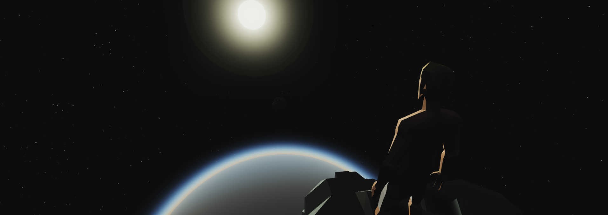

---

# 🌠 | Asteroids Addon

## 📚 | Overview
An addon that adds asteroids to space in Stormworks: Build and Rescue. **This addon requires the Space DLC.**

This addon uses [Aurora Framework](https://github.com/Cuh4/AuroraFramework), a framework I created that tremendously helps with addon development.

Feel free to `git clone`, or even contribute.

P.S: Most of the important addon code is in `src/p3_libraries/asteroids`.

## ❓ | Requirements
- **Python 3.11+**
- **Stormworks: Build and Rescue** (game)

## 💻 | Setup
### 😎 | Simple
TODO
1) [Subscribe to the addon from the Steam workshop.](https://www.add-link.com)
2) Create a new save, but before loading it, enable this addon and the Space DLC.
3) Load into the save and have fun with the addon.

### 🤓 | Advanced
1) Run `git clone "https://github.com/Cuh4/SWAsteroidsAddon.git" "%appdata%/Stormworks/data/missions"`
2) Optionally, change the addon name in `playlist.xml` to whatever you desire.
3) Run `py combiner.py` (or run `combiner.bat`) to create a `script.lua` file. Feel free to close it once it has been created.
4) Create a save with the addon enabled, and have fun with the addon.

## ✨ | Credit
- [**Cuh4**](https://discord.com/users/1141077132915777616) ([GitHub](https://github.com/Cuh4)) 